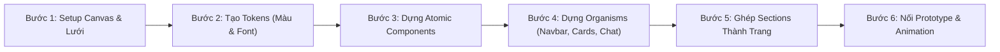
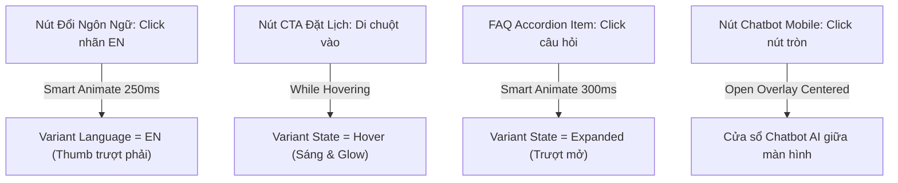

# Hướng Dẫn Chi Tiết Thiết Kế Website Fashion Nails Morley Galleria Trên Figma

Tài liệu này là cẩm nang thiết kế toàn diện, hướng dẫn bạn từng bước một (click-by-click, property-by-property), giải thích rõ ràng từ việc **dùng Frame hay Section**, **tạo gì đầu tiên**, **thiết lập Font Style ra sao**, đến **cách làm chi tiết từng Component** và **ráp layout hoàn chỉnh** cho giao diện Landing Page của **Fashion Nails Morley Galleria** trên **Figma**.

---

## MỤC LỤC
1. [Dùng Frame Hay Section? Quy Tắc Bất Di Bất Dịch Trong Figma](#1-dùng-frame-hay-section-quy-tắc-bất-di-bất-dịch)
2. [Lộ Trình Thực Hiện: Bắt Đầu Từ Đâu? Tạo Gì Đầu Tiên?](#2-lộ-trình-thực-hiện-tạo-gì-đầu-tiên)
3. [Thiết Lập Hệ Thống Lưới (Layout Grids & Spacing)](#3-thiết-lập-hệ-thống-lưới-layout-grids--spacing)
4. [Hệ Thống Design Tokens (Màu Sắc, Typography, Hiệu Ứng)](#4-hệ-thống-design-tokens)
   - 4.1. [Color Styles (Bảng Màu Hoàng Gia & Tinh Tế)](#41-color-styles)
   - 4.2. [Typography Styles (Font Pairings & Type Scale Chuẩn)](#42-typography-styles)
   - 4.3. [Effect Styles (Hiệu Ứng Nổi Khối & Kính Mờ)](#43-effect-styles)
5. [Hướng Dẫn Chi Tiết Cách Tạo Từng Component Thư Viện](#5-hướng-dẫn-chi-tiết-cách-tạo-từng-component)
   - 5.1. [Nút Đổi Ngôn Ngữ (Language Switcher VI \| EN)](#51-nút-đổi-ngôn-ngữ-language-switcher)
   - 5.2. [Nút Đặt Lịch Luxury CTA (Navbar Book CTA)](#52-nút-đặt-lịch-luxury-cta)
   - 5.3. [Floating Island Navbar (Apple Liquid Glass)](#53-floating-island-navbar)
   - 5.4. [Thanh Tìm Kiếm Services (Search Bar - Nền Trắng Đặc)](#54-thanh-tìm-kiếm-services)
   - 5.5. [Thẻ Dịch Vụ (Service Card) & Menu Board](#55-thẻ-dịch-vụ-service-card)
   - 5.6. [FAQ Accordion Card (6 Câu Hỏi Chuẩn)](#56-faq-accordion-card)
   - 5.7. [Cửa Sổ Chatbot AI Trên Mobile (Centered Modal)](#57-cửa-sổ-chatbot-ai-trên-mobile)
   - 5.8. [Google Reviews Social Proof Card 4.9★](#58-google-reviews-social-proof-card)
6. [Quy Trình Ráp Layout Từng Section (Desktop 1440px & Mobile 390px)](#6-quy-trình-ráp-layout-từng-section)
7. [Thiết Lập Prototype Tương Tác & Smart Animate](#7-thiết-lập-prototype-tương-tác)
8. [Xuất File (Export Assets) & Chuyển Giao Lập Trình (Dev Mode)](#8-xuất-file-và-chuyển-giao-dev)

---

## 1. Dùng Frame Hay Section? Quy Tắc Bất Di Bất Dịch

Trong Figma có 3 loại vùng chứa: **Section (`Shift + S`)**, **Frame (`F`)**, và **Group (`Ctrl + G`)**. Hiểu đúng và dùng đúng là bước phân biệt giữa người mới và một Senior UI/UX Designer:

| Tiêu chí | `Section` (`Shift + S`) | `Frame` (`F`) | `Group` (`Ctrl + G`) |
| :--- | :--- | :--- | :--- |
| **Bản chất** | Vùng gom nhóm cấp cao nhất trên Canvas | Khối dựng giao diện có tọa độ & thuộc tính đầy đủ | Nhóm gộp đối tượng đơn giản |
| **Auto Layout** | ❌ Không hỗ trợ | ✅ **Hỗ trợ tối đa** (`Shift + A`) | ❌ Không hỗ trợ |
| **Layout Grid** | ❌ Không | ✅ **Hỗ trợ Grid 12 cột, 4 cột** | ❌ Không |
| **Clip Content**| ❌ Không | ✅ **Có** (cắt tràn nội dung) | ❌ Không |
| **Tô màu (Fill/Stroke)** | ✅ Có (đơn giản) | ✅ **Đầy đủ Gradients, Effects, Blur** | ❌ Kế thừa từ con |
| **Constraints / Resizing** | ❌ Không | ✅ **Fixed, Hug, Fill container** | ❌ Co giãn biến dạng |

### Quy Tắc Áp Dụng Cho Dự Án Fashion Nails:
1. **Dùng `Section` (`Shift + S`) khi nào?**
   - Dùng để **phân chia các phân khu lớn trên Canvas vô cực** của Figma:
     - Vẽ 1 Section lớn đặt tên: `01. Design Tokens & Foundations`.
     - Vẽ 1 Section lớn đặt tên: `02. UI Kit & Master Components`.
     - Vẽ 1 Section lớn đặt tên: `03. Desktop Screens (1440px)`.
     - Vẽ 1 Section lớn đặt tên: `04. Mobile Screens (390px)`.
   - *Tác dụng*: Giúp khi zoom out (thu nhỏ toàn màn hình), tên các phân khu hiện to rõ ràng, không bị rối mắt, và có thể gom nhóm đánh dấu trạng thái "Ready for dev".
2. **Dùng `Frame` (`F`) khi nào?**
   - **TẤT CẢ mọi thành phần giao diện đều dùng Frame**:
     - Màn hình Desktop (1440 x Auto): Dùng **Frame**.
     - Màn hình Mobile (390 x Auto): Dùng **Frame**.
     - Từng Section của trang web (Hero, Services, FAQ...): Dùng **Frame** có bật Auto Layout.
     - Từng Component (Button, Card, Input, Navbar, Chatbot...): Dùng **Frame** có bật Auto Layout.
3. **Tuyệt đối KHÔNG dùng `Group` (`Ctrl + G`)** cho các thành phần UI vì Group không hỗ trợ Auto Layout, không có thuộc tính `Fill container` hay `Hug contents`, khiến giao diện bị vỡ nát khi đổi text hoặc đổi kích thước màn hình.

---

## 2. Lộ Trình Thực Hiện: Tạo Gì Đầu Tiên?

Để không bị bối rối "vẽ cái gì trước, cái gì sau", bạn hãy tuân thủ nghiêm ngặt **6 bước chuẩn Atomic Design** sau:



1. **Bước 1**: Tạo cấu trúc file, vẽ 4 Section phân khu trên Canvas, cài đặt **Layout Grid 12 cột** (Desktop) và **4 cột** (Mobile).
2. **Bước 2**: Khởi tạo **Design Tokens** (Color Styles, Typography Styles, Effect Styles). Bắt buộc làm xong bước này mới được vẽ giao diện để tái sử dụng style đồng bộ.
3. **Bước 3**: Tạo các **Atomic Components** nhỏ nhất: Icon set (16px, 20px, 24px), Nút Đổi Ngôn Ngữ, Nút CTA Đặt Lịch, Badge, Input text.
4. **Bước 4**: Tạo các **Molecules & Organisms**: Floating Island Navbar, Thanh tìm kiếm dịch vụ, Service Card, FAQ Accordion, Chatbot Window.
5. **Bước 5**: Ghép các components vào các Section từ trên xuống dưới trên Frame `Desktop 1440px`, sau đó chuyển đổi sang Frame `Mobile 390px`.
6. **Bước 6**: Chuyển sang tab **Prototype** và nối các luồng tương tác (Hover, Click đổi ngôn ngữ, Mở FAQ, Mở Chatbot popup).

---

## 3. Thiết Lập Hệ Thống Lưới (Layout Grids & Spacing)

### 3.1. Frame Desktop (1440px)
- **Tạo Frame**: Bấm phím `F` -> Bên thanh Properties phải chọn **Desktop** (Width: `1440px`, Height: ban đầu để `1024px`, sau đó kéo dài xuống khoảng `7200px`).
- **Thêm Layout Grid**:
  - Nhấp vào Frame vừa tạo -> Tìm mục **Layout Grid** ở bảng bên phải -> Bấm dấu `+`.
  - Nhấp vào icon ô lưới (Grid icon) bên cạnh chữ "Grid 10px" để đổi sang **Columns**.
  - Cài đặt chính xác các thông số:
    - **Count**: `12`
    - **Type**: `Center`
    - **Width**: `72px`
    - **Gutter**: `24px`
    *(Tổng chiều rộng nội dung là: 12 cột x 72px + 11 rãnh x 24px = **1128px** hoặc dùng Width `76px` + Gutter `24px` = **1176px**, cực kỳ vừa vặn và thẩm mỹ).*

### 3.2. Frame Mobile (390px - iPhone 14/15/16)
- **Tạo Frame**: Bấm phím `F` -> Chọn **iPhone 14 & 15** (Width: `390px`, Height: kéo dài khoảng `8200px`).
- **Layout Grid**:
  - Đổi sang **Columns**.
  - **Count**: `4`
  - **Type**: `Stretch`
  - **Margin**: `16px` (hoặc `20px`)
  - **Gutter**: `12px`

### 3.3. Quy Tắc Spacing Scale (Hệ Thống 8pt / 4pt)
Mọi padding và khoảng cách gap trong Auto Layout phải nhập theo thang đo sau:
- `4px`: Khoảng cách micro giữa icon và chữ nhỏ.
- `8px`: Khoảng cách giữa các chip, icon button, label.
- `12px`: Khoảng cách bên trong input, hàng nhỏ.
- `16px`: Padding cơ bản của thẻ card, khoảng cách giữa các đoạn văn.
- `24px`: Khoảng cách giữa các card trong lưới, padding lớn của card.
- `32px`: Khoảng cách giữa tiêu đề và nội dung card.
- `48px`: Khoảng cách giữa Header Section và nội dung.
- `80px - 100px`: Khoảng cách đệm giữa các Section lớn (Section Padding Vertical).

---

## 4. Hệ Thống Design Tokens

### 4.1. Color Styles
Tạo các Color Style trong Figma: Vẽ một hình vuông phím `R` -> Chọn màu Fill -> Bấm vào biểu tượng 4 dấu chấm (Style) bên cạnh chữ Fill -> Bấm dấu `+` để lưu style với cú pháp `Nhóm/Tên-màu`.

| Tên Style trong Figma | Mã HEX | Công dụng & Vị trí áp dụng |
| :--- | :--- | :--- |
| `Brand/Gold-Primary` | `#C6A15B` | Màu vàng kim thương hiệu chính, viền active, icon chính |
| `Brand/Gold-Dark` | `#A8823E` | Vàng kim đậm cho text active, viền hover |
| `Brand/Gold-Light` | `#E8D5B5` | Viền mạ vàng thanh mảnh, đường phân cách |
| `Brand/Espresso-Noir` | `#281714` | Đen mocha hoàng gia cho nút CTA và viên trượt ngôn ngữ |
| `Brand/Espresso-Deep` | `#150B08` | Đáy gradient của nút CTA sang trọng |
| `Neutral/White` | `#FFFFFF` | Nền thanh tìm kiếm (Solid 100%), nền card, text nút CTA |
| `Neutral/Background` | `#FAF5F0` | Nền warm porcelain chủ đạo của toàn bộ landing page |
| `Neutral/Surface-Soft`| `#F3ECE5` | Nền đệm cho các khối xen kẽ, ô chat bot |
| `Neutral/Border` | `#E8DFD8` | Viền các card, viền input mặc định |
| `Text/Primary` | `#2B1E1A` | Màu chữ tiêu đề chính, tương phản cao, dễ đọc |
| `Text/Secondary` | `#6E534E` | Màu chữ mô tả dịch vụ, nội dung trả lời FAQ |
| `Text/Muted` | `#967C77` | Màu placeholder tìm kiếm, thời lượng dịch vụ |
| `Accent/Ruby-Rose` | `#C22238` | Màu nhấn đặc biệt cho badge ưu đãi giảm 10% |
| `Status/Online-Green` | `#22C55E` | Chấm xanh thông báo chatbot đang trực tuyến |

### 4.2. Typography Styles (Font Pairings & Type Scale)
#### Bước chuẩn bị font:
- Tải 2 bộ font miễn phí từ Google Fonts:
  1. **Font Tiêu Đề (Luxury & Classic)**: `Cormorant Garamond` (hoặc `Playfair Display`).
  2. **Font Giao Diện & Nội Dung (Modern & Clean)**: `Outfit` (hoặc `Plus Jakarta Sans`).

#### Cách tạo Text Style trong Figma:
1. Bấm phím `T` -> Click vào Canvas -> Gõ một dòng chữ mẫu.
2. Bên bảng Text bên phải, chọn Font, Weight, Size, Line height, Letter spacing theo bảng dưới.
3. Click vào biểu tượng 4 dấu chấm (Style) bên cạnh chữ Text -> Nhấn dấu `+` -> Nhập tên style (VD: `Display/Hero-Title`).

| Tên Style trong Figma | Font Family | Size | Weight | Line Height | Letter Spacing |
| :--- | :--- | :--- | :--- | :--- | :--- |
| `Display/Hero-Title` | Cormorant Garamond | `52px` | SemiBold (600) | `115%` | `-0.02em` |
| `Heading/H1-Section` | Cormorant Garamond | `38px` | SemiBold (600) | `120%` | `-0.01em` |
| `Heading/H2-Card` | Outfit | `20px` | SemiBold (600) | `130%` | `0` |
| `Heading/H3-Item` | Outfit | `16px` | SemiBold (600) | `140%` | `0` |
| `Body/Regular` | Outfit | `15px` | Regular (400) | `160%` | `0` |
| `Body/Medium` | Outfit | `15px` | Medium (500) | `150%` | `0` |
| `Button/Primary` | Outfit | `14px` | Bold (700) | `100%` | `+0.02em` |
| `Caption/Small` | Outfit | `12px` | Medium (500) | `140%` | `+0.03em` |
| `Badge/Uppercase` | Outfit | `11px` | Bold (700) | `100%` | `+0.08em` |

### 4.3. Effect Styles
Tạo 3 Effect Styles quan trọng:
1. `Effect/Liquid-Glass-Navbar`:
   - Fill của Frame là `#FFFFFF` với opacity `85%`.
   - Effect: Chọn **Background blur**, giá trị `24px`.
   - Effect: Thêm **Drop shadow**: `X: 0`, `Y: 8px`, `Blur: 24px`, Màu `#2B1E1A` với opacity `8%`.
   - Stroke: Inside `1px`, màu `#FFFFFF` với opacity `90%`.
2. `Effect/Luxury-CTA-Glow`:
   - Drop shadow 1 (Đổ bóng nền sâu): `X: 0`, `Y: 4px`, `Blur: 18px`, Màu `#150B08` opacity `45%`.
   - Drop shadow 2 (Hào quang vàng ấm): `X: 0`, `Y: 0`, `Blur: 14px`, Màu `#E5C170` opacity `35%`.
3. `Effect/Card-Elevated`:
   - Drop shadow: `X: 0`, `Y: 4px`, `Blur: 16px`, Màu `#3B2219` opacity `6%`.
   - Stroke: Inside `1px`, màu `#E8DFD8`.

---

## 5. Hướng Dẫn Chi Tiết Cách Tạo Từng Component

### 5.1. Nút Đổi Ngôn Ngữ (Language Switcher VI | EN)
*Mục tiêu: Tạo viên nang trượt xúc giác Apple-style, nền trắng đặc, viền vàng kim, viên trượt màu Đen Espresso chữ trắng đậm, tương phản sắc nét tuyệt đối.*

#### Bước 1: Vẽ vỏ ngoài (Container Frame)
1. Bấm phím `F`, vẽ một Frame kích thước: Width `76px`, Height `32px`.
2. Bo góc (Corner Radius): Nhập `9999px`.
3. Fill màu: Chọn `Neutral/White` (`#FFFFFF` 100%).
4. Stroke: Nhập `1.5px`, chọn kiểu `Inside`, màu `#C6A15B` (hoặc opacity `50%`).
5. Effects: Thêm Drop shadow `Y: 2px, Blur: 8px, Color: #2B1E1A` opacity `8%`.

#### Bước 2: Vẽ viên trượt Active (Thumb Pill)
1. Bên trong Frame trên, bấm phím `F` vẽ một Frame con: Width `33px`, Height `26px`.
2. Bo góc: Nhập `9999px`.
3. Fill màu: Chọn kiểu **Linear Gradient** góc 135°, điểm 1 `#2A1713` (Đen Mocha), điểm 2 `#150B08` (Espresso đậm).
4. Stroke: `1px Inside`, màu `#E5C170` opacity `45%`.
5. Effects: Drop shadow `Y: 2px, Blur: 6px, Color: #150B08` opacity `35%`.
6. Đặt vị trí: Cách mép trái `3px`, cách mép trên `3px`. Đặt tên layer này là `Thumb`.

#### Bước 3: Tạo 2 nhãn chữ (VI & EN)
1. Bấm phím `T`, gõ chữ `VI`. Chọn Text Style `Caption/Small`, Weight `Bold`, gán màu `#FFFFFF`. Đặt nằm chính giữa viên Thumb bên trái.
2. Bấm phím `T`, gõ chữ `EN`. Chọn Text Style `Caption/Small`, Weight `Bold`, gán màu `Text/Secondary` (`#6E534E`). Đặt nằm ở vị trí nửa bên phải (cách mép phải khoảng `10px`).

#### Bước 4: Tạo Master Component & Variants
1. Chọn toàn bộ Frame vỏ ngoài -> Nhấn tổ hợp phím `Ctrl + Alt + K` (Mac: `Cmd + Option + K`) để biến thành Master Component. Đặt tên: `Language Switcher`.
2. Bên thanh Properties phải, bấm dấu `+` tại **Variants** -> Chọn **Add variant**.
3. Đổi tên Property thành `Language`.
4. Variant 1: `Language = VI` (Thumb ở vị trí X=3px; chữ VI màu trắng `#FFFFFF`; chữ EN màu nâu `#6E534E`).
5. Variant 2: `Language = EN`:
   - Kéo layer `Thumb` sang phải: vị trí X=`40px`.
   - Đổi chữ `EN` thành màu trắng `#FFFFFF`.
   - Đổi chữ `VI` thành màu nâu `#6E534E`.

---

### 5.2. Nút Đặt Lịch Luxury CTA (Navbar Book CTA)
*Mục tiêu: Tạo nút kêu gọi hành động cao cấp, nổi bật vượt trội trên cả nền Hero trong suốt lẫn thanh kính cuộn.*

#### Bước 1: Dựng cấu trúc Auto Layout
1. Bấm phím `T`, gõ chữ `Đặt lịch` (hoặc `Book Now`). Chọn style `Button/Primary`, màu `#FFFFFF`.
2. Chèn 2 icon từ Lucide Icons (hoặc icon SVG):
   - Icon `Calendar` bên trái text, kích thước `16x16px`, màu vàng kim `#F8D786`.
   - Icon `Sparkles` bên phải text, kích thước `13x13px`, màu vàng kim `#F8D786`.
3. Chọn cả 3 phần tử (Icon Lịch + Text + Icon Sao) -> Nhấn phím tắt `Shift + A` để bọc trong **Auto Layout**.

#### Bước 2: Cài đặt thông số Frame Nút
1. **Auto Layout Properties**:
   - Direction: *Horizontal layout* (Ngang).
   - Alignment: *Align center* (Căn giữa).
   - Spacing between items (Gap): `8px`.
   - Padding Horizontal: `20px`.
   - Padding Vertical: `9px` (Chiều cao tổng thể đạt chuẩn `42px - 44px`).
2. **Bo góc (Corner Radius)**: Nhập `9999px`.
3. **Fill màu**:
   - Chọn **Linear Gradient** góc 135°.
   - Điểm bắt đầu (0%): `#281714` (Đen Mocha sâu).
   - Điểm kết thúc (100%): `#150B08` (Espresso đậm).
4. **Stroke**:
   - Độ dày: `1.5px`, kiểu `Inside`.
   - Màu: `#E5C170` (Mạ vàng hoàng kim rực rỡ).
5. **Effects**:
   - Effect 1: Drop Shadow `X: 0, Y: 4px, Blur: 18px, Color: #150B08` opacity `45%`.
   - Effect 2: Drop Shadow `X: 0, Y: 0, Blur: 14px, Color: #E5C170` opacity `35%` (Hào quang ánh kim ấm áp).

#### Bước 3: Tạo Component & Variant Hover
1. Nhấn `Ctrl + Alt + K` tạo Component, đặt tên `Btn / Navbar CTA`.
2. Thêm Variant `State = Hover`:
   - Tăng độ sáng nền: Điểm gradient đổi thành `#3A211B` đến `#1E100C`.
   - Stroke đổi thành `#F8D98C`.
   - Shadow tăng lên: `Blur: 26px`, hào quang vàng sáng hơn.

---

### 5.3. Floating Island Navbar (Apple Liquid Glass)

#### Bước 1: Dựng khung chứa tổng thể (Navbar Island)
1. Vẽ Frame: Width `1200px`, Height `64px`.
2. Bật Auto Layout (`Shift + A`):
   - Direction: *Horizontal*.
   - Alignment: *Align center*.
   - Spacing mode: Đổi từ *Packed* sang **Space between** (Icon logo ở sát trái, action ở sát phải, tab bar ở chính giữa).
   - Padding: Horizontal `24px`, Vertical `10px`.

#### Bước 2: Dựng Brand Logo bên trái
1. Vẽ Frame con: Auto Layout Horizontal, Gap `10px`, Align center.
2. Chèn Logo Crown mạ vàng (kích thước `32x32px`).
3. Vẽ cụm Text: Auto Layout Vertical, Gap `0px`:
   - Dòng 1: "Fashion Nails" (Font `Cormorant Garamond`, Size `18px`, Weight `Bold`, Màu `Text/Primary`).
   - Dòng 2: "MORLEY GALLERIA" (Font `Outfit`, Size `9px`, Weight `SemiBold`, Letter spacing `+0.12em`, Màu `Brand/Gold-Dark`).

#### Bước 3: Dựng thanh Liquid Glass Pill ở giữa
1. Vẽ Frame con: Height `44px`, Corner Radius `9999px`.
2. Bật Auto Layout: Horizontal, Padding `4px`, Gap `4px`, Align center.
3. Fill màu: `#FFFFFF` với opacity `75%`.
4. Effect: **Background Blur** `24px`.
5. Stroke: `1px solid rgba(255, 255, 255, 0.9)`.
6. Drop Shadow: `Y: 4px, Blur: 16px, Color: #2B1E1A` opacity `6%`.
7. Bên trong tạo các Tab items:
   - Icon nút phụ bên trái (16px).
   - Các nút Tab: *Trang chủ*, *Dịch vụ*, *Về chúng tôi*, *Bộ sưu tập*, *Đánh giá*.
   - Tab Active (VD: "Trang chủ"): Bọc trong Frame con có Fill kem ấm `#F8F3EC`, Radius `9999px`, Text màu vàng đậm `#A8823E` Bold.
   - Các Tab khác: Không fill, Text màu `#6E534E` Medium.
   - Icon kính lúp bên phải (16px).

#### Bước 4: Dựng cụm Action bên phải
1. Vẽ Frame: Auto Layout Horizontal, Gap `10px`, Align center.
2. Kéo Component **Language Switcher** vào.
3. Kéo Component **Btn / Navbar CTA** vào.

---

### 5.4. Thanh Tìm Kiếm Services (Search Bar - Nền Trắng Đặc)
*Lưu ý cốt lõi: Giải quyết dứt điểm lỗi trong suốt bằng màu nền Solid White 100%.*

#### Bước 1: Cấu trúc Auto Layout
1. Bấm phím `F`, vẽ Frame: Width `540px`, Height `52px` (Trên Mobile: chỉnh Width thành `Fill container`).
2. Bo góc (Corner Radius): `9999px`.
3. Bật Auto Layout:
   - Direction: *Horizontal*.
   - Alignment: *Align center*.
   - Padding: Left `20px`, Right `16px`.
   - Gap: `12px`.

#### Bước 2: Màu sắc & Hiệu ứng nổi khối
1. **Fill**: Chọn màu Solid `#FFFFFF` với độ mờ **100%** (Tuyệt đối không để opacity < 100%).
2. **Stroke**: `1.5px Inside`, màu `Neutral/Border` (`#E8DFD8`).
3. **Effects**: Drop shadow `X: 0, Y: 2px, Blur: 10px, Color: #5C3531` opacity `6%`.

#### Bước 3: Các thành phần bên trong
1. Icon `Search`: Kích thước `18x18px`, màu vàng kim `Brand/Gold-Primary` (`#C6A15B`).
2. Text Placeholder: Gõ *"Tìm nhanh dịch vụ (ví dụ: BIAB, Acrylic, Shellac, Mắt Mèo...)"*.
   - Font: `Outfit`, Size `15px`, Weight `Regular`.
   - Màu: `Text/Muted` (`#967C77`).
   - Resizing: Đổi thành **Fill container** (để text chiếm trọn chiều rộng còn lại).
3. Icon Clear `X`: Frame tròn 26x26px, Fill trong suốt, Stroke 1px `#E8DFD8`, bên trong chứa icon dấu X nhỏ màu xám (dùng để xóa từ khóa khi gõ).

#### Bước 4: Tạo Component & Variant Focus
- Variant `State = Focus`:
  - Stroke đổi sang `Brand/Gold-Primary` (`#C6A15B`).
  - Thêm Outer Glow Shadow: `X: 0, Y: 0, Blur: 0, Spread: 3px, Color: rgba(198, 161, 91, 0.25)`.

---

### 5.5. Thẻ Dịch Vụ (Service Card) & Menu Board

#### Bước 1: Thẻ Dịch Vụ Đơn Lẻ (Service Card)
1. Vẽ Frame: Width `360px`, Corner Radius `16px`.
2. Bật Auto Layout: Vertical, Padding `0px`, Gap `0px`.
3. Fill: `#FFFFFF`, Stroke: `1px solid #E8DFD8`, Shadow: `Y: 4px, Blur: 16px, rgba(0,0,0,0.04)`.
4. **Vùng Ảnh Header**:
   - Frame con: Width `360px`, Height `225px` (Tỉ lệ 16:10).
   - Fill: Image (Chọn ảnh mẫu móng chụp thực tế).
   - Gắn 1 Badge ở góc trên bên trái: Auto Layout, Padding 4px 10px, Radius 9999px, Fill đen mờ `#150B08` 75%, Text "BIAB / BUILDER GEL" màu vàng kim 11px Bold.
5. **Vùng Nội Dung (Card Body)**:
   - Auto Layout Vertical, Padding `20px`, Gap `12px`.
   - Dòng tiêu đề & Giá: Auto Layout Horizontal, Space between:
     - Tên dịch vụ: "BIAB Nuôi Móng Thật & Form Chuẩn", Font `Outfit 18px Bold`, màu `Text/Primary`.
     - Giá tiền: "$65 AUD", Font `Outfit 20px Bold`, màu `Brand/Gold-Dark`.
   - Mô tả: "Đắp gel tăng cường dẻo dai nuôi móng yếu, ngăn ngừa gãy gập, bóng đẹp 4 tuần", Font `Outfit 14px Regular`, màu `Text/Secondary`.
   - Footer thẻ: Hàng chứa icon đồng hồ `Clock` 14px + "Thời gian: 45 phút" + Nút nhỏ "Đặt dịch vụ này".

---

### 5.6. FAQ Accordion Card (6 Câu Hỏi Chuẩn)
*Mục tiêu: Đáp ứng yêu cầu số 5 (Rút gọn 6 câu hỏi) với tương tác mở/đóng chuẩn Auto Layout.*

#### Bước 1: Dựng Frame Accordion
1. Vẽ Frame: Width `840px` (trên Mobile là `Fill container`), Corner Radius `16px`.
2. Fill: `#FFFFFF`, Stroke: `1.5px solid #E8DFD8`.
3. Bật Auto Layout: Vertical, Padding `20px 24px`, Gap `14px`.

#### Bước 2: Hàng Tiêu Đề (Question Row)
1. Frame con: Auto Layout Horizontal, Space between, Align center, Width `Fill container`.
2. Cụm bên trái: Auto Layout Horizontal, Gap `12px`, Align center:
   - **Tag danh mục**: Auto Layout, Padding 4px 10px, Radius 9999px, Fill `#FAF3E8`, Text "CÔNG NGHỆ MÓNG" màu `#A8823E` 11px Bold.
   - **Text câu hỏi**: "Sự khác biệt giữa BIAB, Gel X, Shellac và Acrylic là gì?", Font `Outfit 16px SemiBold`, màu `Text/Primary`.
3. Nút Chevron bên phải: Frame tròn 32x32px, Fill `#FAF5F0`, chứa icon `ChevronDown` 16px màu `#6E534E`.

#### Bước 3: Vùng Câu Trả Lời (Answer Container)
1. Frame con: Auto Layout Vertical, Gap `8px`, Width `Fill container`.
2. Text nội dung: Font `Outfit 15px Regular`, Line height `160%`, màu `Text/Secondary`.
3. Nhập nội dung chi tiết với các bullet points in đậm:
   - `• BIAB`: Dòng gel tăng cường dẻo dai đắp trực tiếp trên móng tự nhiên...
   - `• Gel X`: Móng úp full-cover làm từ 100% soft-gel...
   - `• Acrylic`: Bột đắp móng truyền thống cứng cáp nhất...
   - `• Shellac`: Sơn gel bóng gương trên móng thật bền 2-3 tuần...

#### Bước 4: Tạo Component Set với 2 Variants
1. Nhấn `Ctrl + Alt + K` tạo Component, đặt tên `Accordion / FAQ Item`.
2. Tạo 2 Variants:
   - **Variant 1 (`State = Collapsed`)**: Ẩn layer `Answer Container` (tắt mắt Eye layer), icon Chevron trỏ xuống. Stroke là `#E8DFD8`.
   - **Variant 2 (`State = Expanded`)**: Bật layer `Answer Container`, xoay icon Chevron `180°`, Stroke đổi sang màu vàng kim `Brand/Gold-Primary` (`#C6A15B`).

---

### 5.7. Cửa Sổ Chatbot AI Trên Mobile (Centered Modal)
*Mục tiêu: Đáp ứng yêu cầu số 3 (Chatbot trên mobile to nhưng căn ngay trung tâm màn hình).*

#### Bước 1: Khung Mờ Nền Toàn Màn Hình (Mobile Dim Backdrop)
1. Bấm phím `F`, vẽ Frame đúng kích thước iPhone: Width `390px`, Height `844px`.
2. Fill: Màu `#12100E` với opacity `55%`.
3. Effects: Thêm **Background blur** `4px`.

#### Bước 2: Cửa Sổ Chatbot Trung Tâm (Centered Window)
1. Bên trong Backdrop trên, vẽ một Frame:
   - **Width**: `366px` (Cách đều mép trái và mép phải 12px, chiếm 94% chiều rộng màn hình).
   - **Height**: `640px` (Chiếm 76% chiều cao màn hình, rất rộng rãi và dễ thao tác).
   - **Căn giữa tuyệt đối**: Nhấn tổ hợp phím `Alt + H` (Align Horizontal Centers) và `Alt + V` (Align Vertical Centers).
2. Bo góc (Corner Radius): `24px`.
3. Fill: `#FFFFFF`.
4. Stroke: `1.5px solid rgba(197, 168, 128, 0.65)` (Viền mạ vàng sang trọng).
5. Effects: Drop Shadow `X: 0, Y: 24px, Blur: 60px, Color: #000000` opacity `45%`.
6. Bật Auto Layout: Vertical, Clip content.

#### Bước 3: 4 Phân Vùng Của Chatbot
1. **Header (Top - Cao 58px)**:
   - Auto Layout Horizontal, Padding 12px 16px, Space between, Align center, Border bottom 1px `#E8DFD8`.
   - Bên trái: Avatar tròn 36px chứa vương miện mạ vàng + Cụm tiêu đề "Fashion Nails AI" + Hàng trạng thái chứa chấm xanh lá `Status/Online-Green` và chữ "Trực tuyến & Sẵn sàng tư vấn".
   - Bên phải: Nút Reset cuộc trò chuyện và nút Đóng `X` tròn 32px.
2. **Messages Container (Middle - Fill Height)**:
   - Auto Layout Vertical, Padding 16px, Gap 12px, Resizing Height = **Fill container**, Cuộn dọc.
   - **Bubble Bot**: Auto Layout, Radius 16px (góc dưới trái bo 4px), Fill `#F8F4EF`, Text 14px màu `#2B1E1A`.
   - **Bubble User**: Auto Layout, Radius 16px (góc dưới phải bo 4px), Fill gradient `#2A1713` đến `#150B08`, Text 14px màu trắng `#FFFFFF`.
3. **Quick Prompt Chips (Khung Gợi Ý Câu Hỏi Nhanh)**:
   - Auto Layout Horizontal, Padding 8px 14px, Gap 8px, Cuộn ngang.
   - Các viên thuốc bo tròn 9999px: Fill `#FAF5F0`, Stroke 1px `#C6A15B`, Text 12px SemiBold: *"Bảng giá BIAB"*, *"Khử trùng y tế"*, *"Đặt lịch hẹn"*, *"Địa chỉ tiệm"*.
4. **Input Bar (Bottom - Cao 54px)**:
   - Auto Layout Horizontal, Padding 8px 12px, Gap 8px, Align center, Border top 1px `#E8DFD8`.
   - Ô nhập: Height 38px, Resizing Fill container, Radius 9999px, Fill `#FAF5F0`, Placeholder "Hỏi về giá móng, đặt lịch...".
   - Nút Send: Tròn 38x38px, Fill `#C6A15B`, icon mũi tên gửi màu trắng.

---

### 5.8. Google Reviews Social Proof Card 4.9★
1. Frame: Width `340px`, Corner Radius `16px`, Auto Layout Vertical, Padding `16px 20px`, Gap `8px`.
2. Fill: Kính trắng `#FFFFFF` 90%, Effect Background blur 16px, Stroke 1px `#FFFFFF`.
3. Header: Logo 4 màu chuẩn của Google + Huy hiệu tích xanh "Đã xác thực Google Maps".
4. Điểm số: Text `4.9` to đậm (Outfit 32px Bold `#2B1E1A`) + Hàng 5 ngôi sao vàng Google chuẩn mã `#FBBC04` + Text "Dựa trên 500+ đánh giá thực tế của cư dân Morley".

---

## 6. Quy Trình Ráp Layout Từng Section

Mở trang Canvas `Desktop - 1440px`, tạo Frame chính `1440 x Auto` và ráp 8 Section theo thứ tự chuẩn:

### 6.1. Hero Section (Khu Vực Đầu Trang)
1. **Background**: Gradient ấm áp từ `#FAF5F0` (đỉnh) đến `#F3ECE5` (đáy), chiều cao khoảng `760px`.
2. **Navbar**: Đặt Component `Floating Island Navbar` ở vị trí cách đỉnh trang `20px`, căn giữa màn hình (Align Horizontal Center).
3. **Nội dung Hero (Split 2 Cột - Auto Layout Horizontal, Gap 60px, Width 1140px, Align center)**:
   - **Cột trái (Nội dung văn bản - Width 540px)**:
     - Badge: *"TIỆM NAIL HOÀNG GIA TẠI MORLEY GALLERIA - PERTH WA"*.
     - Headline chính (H1): *"Nâng Tầm Đẳng Cấp Đôi Bàn Tay Với Nghệ Thuật Móng Chuẩn Úc"*.
     - Đoạn dẫn chứng: *"Trải nghiệm 26 dịch vụ tiêu chuẩn từ BIAB, Gel X, Acrylic đến Nghệ thuật sơn vẽ cao cấp. Khử trùng 100% chuẩn y tế WA Health"*.
     - Nhóm nút bấm đôi: Nút chính **Btn / Navbar CTA** ("Đặt lịch ngay") + Nút phụ viền mảnh ("Xem Bảng Giá Menu").
     - Kéo component **Google Reviews Social Proof Card 4.9★** đặt ngay phía dưới.
   - **Cột phải (Visual Banner / Carousel - Width 540px)**:
     - Frame bo tròn góc `28px`, đổ bóng sâu `Y: 16px, Blur: 40px`.
     - Chèn ảnh chụp mẫu móng BIAB French hoặc Stiletto Cobalt hoàng gia cao cấp.
     - Đính kèm thẻ badge nổi: *"100% Autoclave Sterilised"*.

### 6.2. Trust Bar (Thanh Cam Kết 4 Trụ Cột)
- Frame: Width `1140px`, Corner Radius `16px`, Fill `#FFFFFF`, Shadow nhẹ.
- Auto Layout Horizontal, 4 cột chia đều nhau:
  1. *Khử trùng Autoclave y tế WA Health*.
  2. *26+ Dịch vụ móng tiêu chuẩn cao cấp*.
  3. *Bảo hành móng 5 ngày miễn phí*.
  4. *Đậu xe miễn phí cả ngày đối diện Kmart*.

### 6.3. Services Section (Dịch Vụ & Bảng Giá)
- Background: Nền warm porcelain `#FAF5F0`.
- Header: Badge "MENU DỊCH VỤ SALON ÚC", Tiêu đề H1 "Bảng Giá & Dịch Vụ Nghệ Thuật Móng", Phụ đề 1 dòng.
- **Thanh Tìm Kiếm Dịch Vụ**: Đặt Component **Thanh Tìm Kiếm Services** (nền trắng đặc `#FFFFFF`) ở chính giữa.
- **Hàng Tab phân loại**: *Tất cả*, *BIAB*, *Gel X*, *Acrylic*, *Shellac*, *Spa Pedicure*.
- **Lưới thẻ dịch vụ**: Lưới 3 cột x 2 hàng chứa các **Service Card** (tổng cộng 6 thẻ nổi bật).

### 6.4. Salon Storytelling & Why Choose Us (Quy Trình Tiệt Trùng Y Tế)
- Trình bày 2 cột trực quan:
  - Cột 1: Ảnh chụp cận cảnh nồi hấp tiệt trùng áp suất cao y tế Autoclave.
  - Cột 2: Bảng cam kết vệ sinh 3 bước: Túi hấp nhiệt niêm phong xé trước mặt khách; Que dũa & đệm móng dùng 1 lần; Kỹ thuật viên đeo găng tay y tế.

### 6.5. Gallery Showcase (Bộ Sưu Tập Nghệ Thuật Móng)
- Lưới 4 cột ảnh phong cách Pinterest / Instagram hiển thị các tác phẩm móng: Móng tráng gương Chrome, Mắt mèo Cat Eye kim cương, Phun Ombré Airbrush, Đắp gel nổi 3D ngọc trai.

### 6.6. FAQ Section (Giải Đáp Đúng 6 Câu Hỏi)
- Căn giữa trang với độ rộng `840px`.
- Đặt liên tiếp **6 Component Accordion FAQ Item** đã tạo ở bước 5.6:
  1. *Khác biệt giữa BIAB, Gel X, Shellac và Acrylic?* (Để trạng thái `Expanded` hiển thị câu trả lời).
  2. *Móng giữ được bao lâu và khi nào nên đi Infill?* (`Collapsed`).
  3. *Dụng cụ có được tiệt trùng chuẩn Autoclave y tế Úc không?* (`Collapsed`).
  4. *Chính sách bảo hành móng miễn phí trong 5 ngày?* (`Collapsed`).
  5. *Tiệm có nhận khách vãng lai (Walk-ins) không hay phải đặt trước?* (`Collapsed`).
  6. *Vị trí tại Morley Galleria, bãi đậu xe miễn phí & Ưu đãi giảm giá 10%?* (`Collapsed`).

### 6.7. Testimonials & Footer
- Carousel 3 thẻ đánh giá thực tế của khách hàng Perth.
- Footer: Nền Đen Mocha `#1F1614`, chữ màu kem, hiển thị địa chỉ Shop SP094 (đối diện Kmart), hotline `(08) 9375 2888`, giờ mở cửa từng ngày trong tuần và bản đồ chỉ đường.

---

## 7. Thiết Lập Prototype Tương Tác & Smart Animate

Chuyển sang tab **Prototype** ở góc trên bên phải màn hình để nối dây tương tác:



1. **Tương tác Nút Đổi Ngôn Ngữ**:
   - Chọn nhãn text `EN` trong variant `Language = VI` -> Kéo dây sang variant `Language = EN`.
   - Interaction: `On click` -> `Change to`.
   - Animation: Chọn **Smart animate**, đường cong: `Custom bezier (0.16, 1, 0.3, 1)`, thời gian: `250ms`.
   - *Kết quả*: Viên thumb màu espresso lướt mượt mà sang phải và chữ chuyển sang trắng sáng.
2. **Tương tác Mở / Đóng FAQ**:
   - Chọn hàng tiêu đề của variant `State = Collapsed` -> Kéo dây sang variant `State = Expanded`.
   - Interaction: `On click` -> `Change to`.
   - Animation: **Smart animate**, thời gian: `300ms`.
   - *Kết quả*: Khung câu trả lời trượt mở êm ái, icon mũi tên quay 180°.
3. **Tương tác Mở Chatbot Popover Trên Mobile**:
   - Trên Frame Mobile 390px, chọn icon nút tròn Chatbot ở góc phải dưới.
   - Kéo dây sang Frame **Cửa Sổ Chatbot AI Trên Mobile** (đã vẽ ở bước 5.7).
   - Interaction: `On click` -> Action: chọn **Open overlay**.
   - Overlay setting: Chọn **Centered** (Căn giữa tuyệt đối màn hình).
   - Đánh dấu tick chọn:
     - `Close when clicking outside` (Bấm ra ngoài vùng mờ để đóng).
     - `Add background: #12100E` với opacity `55%`.
   - Animation: **Move in** từ dưới lên hoặc **Dissolve**, thời gian `250ms`.

---

## 8. Xuất File Và Chuyển Giao Dev

1. **Xuất Icon Chuẩn SVG**:
   - Chọn các icon trong UI Kit -> Tại bảng Export bên phải dưới, chọn định dạng **SVG** -> Nhấn `Export`.
   - *Lý do*: SVG là đồ họa vector, khi đưa vào React/Vite sẽ hiển thị sắc nét tuyệt đối trên mọi độ phân giải màn hình Retina.
2. **Xuất Hình Ảnh WebP / PNG @2x**:
   - Các ảnh chụp móng và hero banner: Chọn định dạng **PNG** với tỉ lệ `@2x` hoặc nén **WebP** để website đạt điểm Pagespeed 99/100.
3. **Sử Dụng Figma Dev Mode (`Shift + D`)**:
   - Nhấn `Shift + D` để kích hoạt giao diện lập trình viên.
   - Khi click vào bất kỳ thành phần nào (nút CTA, thanh tìm kiếm, màu sắc), Figma sẽ hiển thị trực tiếp mã CSS chính xác:
     ```css
     /* Ví dụ mã CSS trích xuất trực tiếp từ component Nút CTA */
     display: flex;
     padding: 9px 20px;
     border-radius: 9999px;
     background: linear-gradient(135deg, #281714 0%, #150B08 100%);
     border: 1.5px solid #E5C170;
     box-shadow: 0px 4px 18px rgba(21, 11, 8, 0.45), 0px 0px 14px rgba(229, 193, 112, 0.35);
     ```

---
*Tài liệu hướng dẫn được thiết kế chuyên biệt và đồng bộ 100% với mã nguồn của dự án Fashion Nails Landing Page.*
